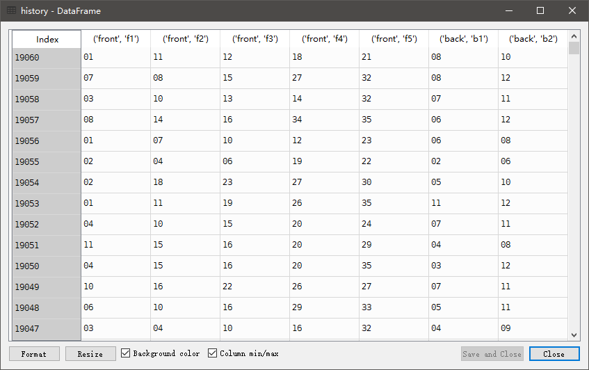
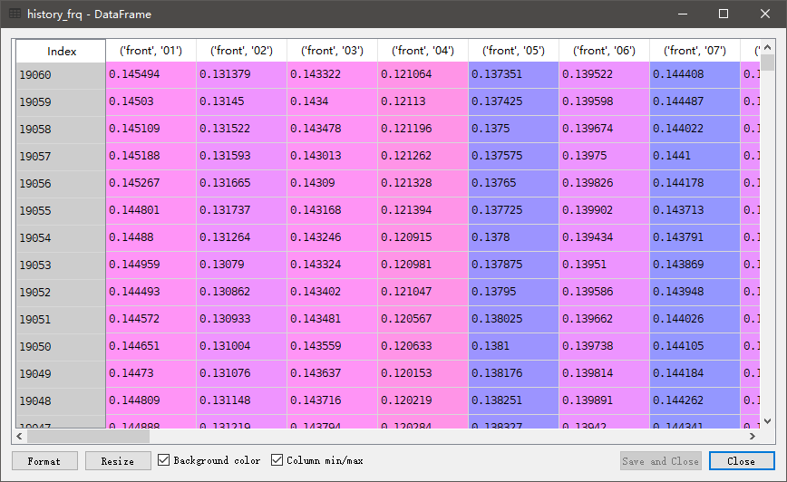

# 日薪百万

第三方库依赖：
```
requests
lxml
sqlalchemy
pandas
```

已有功能：<br>
- 爬取大乐透历史数据并保存到数据库（默认SQLite3）中

- 简单的出现频率获取


项目结构：
```
MillionsPerDay
├── common.py
│   ├── get_html()    根据传入的url获取对应的XPath解析对象
│   ├── add2db()    向数据库某表中添加数据
│   ├── get_last_term()    获取数据库某表中最新一期期号
│   └── get_history()    获取数据库某表中历史数据
├── dlt_tools.py
│   ├── update()    更新大乐透数据
│   ├── check_awards()    检查预测的获奖情况
│   ├── get_freq()    求一段时间内各号出现次数
│   └── get_winning_rate()    计算中奖率
├── dlt.py    测试脚本
……
```

待有功能：<br>
- 爬取其他彩票历史数据
- 界面（窗体或浏览器）
- 数据分析